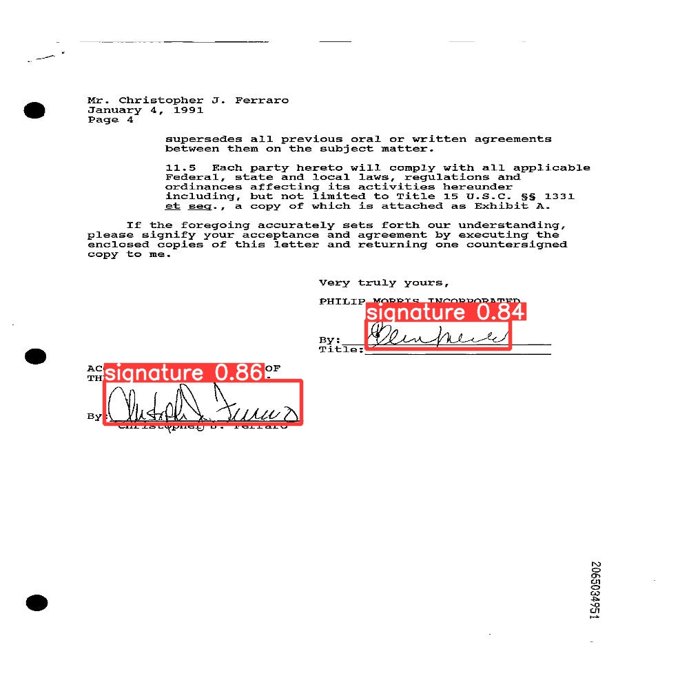
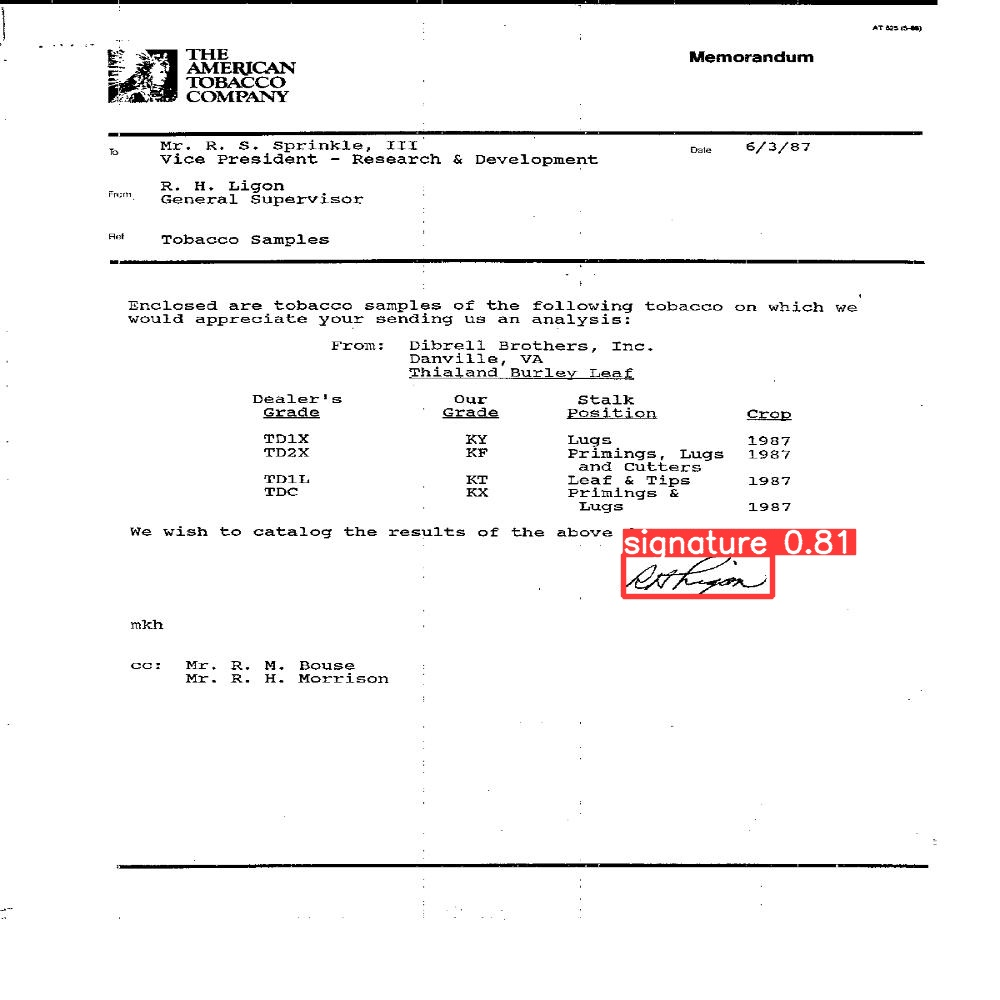

# Signature-object-detection

**Identifying to whom a handwritten signature belongs to and whether it is real or forged through a multistage pipelin**

## Objectives
1) identitfing if signature real vs fake =>  this was done with feature extraction methods like sift,hog and canny edge detector methods then using SVM classifier

2) identitfing to whom signature belongs => this was done by building convolution neural network using keras (conv2d , maxpool, avg pool then flatten Layers ) for feature extration then dense layers followed by softMax for classification

3) identitfing and locating signature in a document img => this was done by using a pretrained YOLO model
https://www.youtube.com/watch?v=80Q3HIBy7Qg

## Dataset 

This dataset provided contains of 5 subfolders and each subfolder of these  contains train and test folders 
[Data link](https://drive.google.com/file/d/1WqIhqp9JJ65SZPs9v868P_-SBCVTR2By/view?usp=sharing)

This dataset consists of four folders:  
‘TrainImages’ folder : contains the training images (660 images) for the detection task  
- ‘TrainGroundTruth’ folder: contains the corresponding detection labels (660 files) for training detection task  
• Each image in ‘TrainImages’ folder has a corresponding text file in this folder with the same name as the image  
• The text file has (1 or more) rows. Each row represents the bounding box of a single signature.  
• Each row has 4 values: x1,y1,x2,y2  
- ‘TestImages’ folder : contains the training images (115 images) for the detection task  
- ‘TestGroundTruth’ folder: contains the corresponding detection  
labels (115 files) for testing the detection task  

[Data link] (https://drive.google.com/file/d/1gew1zSfSZKiUKGPGc3bpGXbO03HvE9-_/view?usp=sharing)

## Images

